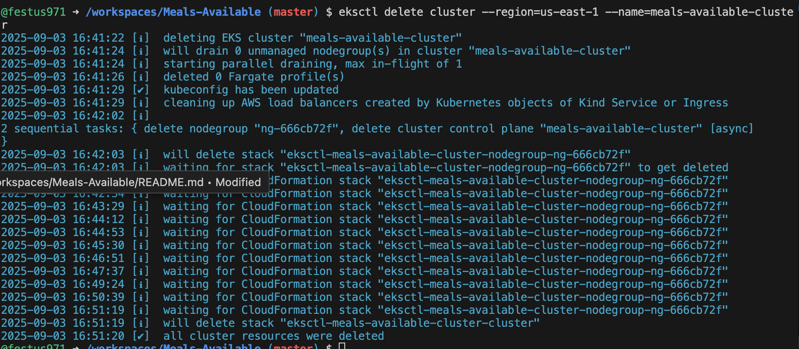

# Meal app
 ## By festus kiprop
 ## Table of Content
 - [Description](#description)
 - [Features](#features)
 - [Technology  Used](#technology-Used)
 - [Licence](#licence)
 - [Author Info](#Authors-Info)
 ## Description
 
 <p>This Repository Contains the meal-available app.</p>
 
[Go Back to the top](#Meal-available App)
## Features
A  single page website for a Meal Menu .
[Go Back to the top](#Meal-available app)
 ###  Requirements
 
 * Access to  a computer or any other garget
 * Access to internet
 * visit the website on your browser
 ****
 [Go Back to the top](#Meal app)

### Live Link
- Click this link to view the live application [festus971.github.io/meals-available/
Topics
Resources
]
### Technology  Used

* HTML - which was used to develope the structure off the pages.
* CSS - Which is used to style the page
* Javascript - which is used for interactivity and manipulation of the page.

    
        
[Go Back to the top](#Meal- available app)
## Known Bugs
* Responsiveness breaks on small-screen devices.
* The page might take time to respond or fetch info from the API used.

## Deploying Meals-Available to AWS EKS

This section describes the steps taken to deploy the Meals-Available service to AWS Elastic Kubernetes Service (EKS).

### Prerequisites

- AWS account
- AWS CLI installed and configured (`aws configure`)
- Docker installed and account on Docker Hub
- kubectl installed
- eksctl installed

### Step-by-Step Deployment Journey

#### 1. Build Docker Image
Build the Docker image from the project root:
```bash
docker build -t <your-dockerhub-username>/meals-available:latest .
```

#### 2. Push Image to Docker Hub
Login and push the image:
```bash
docker login -u <your-dockerhub-username>
docker push <your-dockerhub-username>/meals-available:latest```

#### 3. Create EKS Cluster
Create a cluster with eksctl:
```bash
eksctl create cluster --name meals-available-cluster --region us-east-1 --nodes 2
```

#### 4. Update kubeconfig
```bash
aws eks --region us-east-1 update-kubeconfig --name meals-available-cluster
```

#### 5. Deploy to EKS
Apply the Kubernetes manifests:
```bash
kubectl apply -f k8s/deployment.yaml
kubectl apply -f k8s/service.yaml
```

#### 6. Check Service and Access App
Get the external DNS of the LoadBalancer service:
```bash
kubectl get svc meals-available-svc
```
Access the app in your browser using the EXTERNAL-IP (DNS name) provided.

#### 7. Troubleshooting
- Ensure your image is public and `imagePullPolicy` is not set to `Never`.
- Check pod status with `kubectl get pods`.
- Check AWS Console > EC2 > Load Balancers for DNS and health.

---
#### 8 . delete resources

```bash
eksctl delete cluster --region=us-east-1 --name=meals-available-cluster
```
will delete your EKS cluster and all associated resources created by eksctl, including:
- Worker nodes
- Node groups
- Load balancers created by Kubernetes services
- CloudFormation stacks
- Networking resources (VPC, subnets, etc. if created by eksctl)



## MIT License
Copyright (c) [2025] [Festus kiprop] 
Permission is hereby granted, free of charge, to any person obtaining a copy
of this software and associated documentation files (the "Software"), to deal
in the Software without restriction, including without limitation the rights
to use, copy, modify, merge, publish, distribute, sublicense, and/or sell
copies of the Software, and to permit persons to whom the Software is
furnished to do so, subject to the following conditions:
The above copyright notice and this permission notice shall be included in all
copies or substantial portions of the Software.
THE SOFTWARE IS PROVIDED "AS IS", WITHOUT WARRANTY OF ANY KIND, EXPRESS OR
IMPLIED, INCLUDING BUT NOT LIMITED TO THE WARRANTIES OF MERCHANTABILITY,
FITNESS FOR A PARTICULAR PURPOSE AND NONINFRINGEMENT. IN NO EVENT SHALL THE
AUTHORS OR COPYRIGHT HOLDERS BE LIABLE FOR ANY CLAIM, DAMAGES OR OTHER
LIABILITY, WHETHER IN AN ACTION OF CONTRACT, TORT OR OTHERWISE, ARISING FROM,
OUT OF OR IN CONNECTION WITH THE SOFTWARE OR THE USE OR OTHER DEALINGS IN THE
SOFTWARE.
## Authors Info
        festus kiprop 